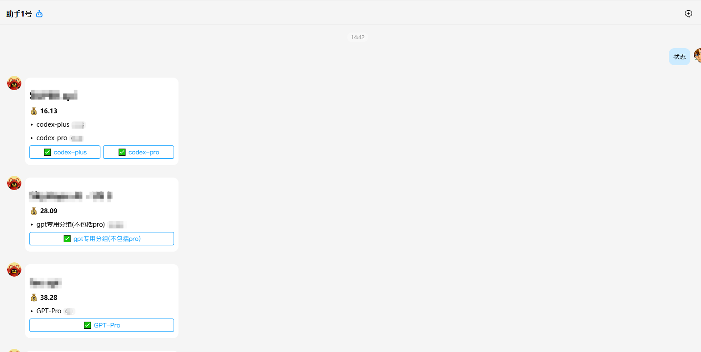

# sbaiapi

<div align="center">

**轻量级上游 API 余额、分组倍率和令牌状态监控工具**

适合同时接入多个 `subapi` / `newapi` 面板时，集中监控余额、倍率变化，并通过 QQBot 推送异常。


</div>

## 预览



## 它能做什么

- 监控多个上游站点余额。
- 自动识别令牌绑定的分组。
- 对比分组倍率，发现涨价 / 降价。
- 涨价幅度超过阈值时，自动禁用对应分组令牌。
- 通过官方 QQ 机器人推送异常提醒。
- QQ 发送 `状态`，查看最近一次监控结果。
- 卡片按钮可直接切换分组令牌启用 / 禁用状态。

## 支持类型

### subapi

默认适配这类接口：

```text
/api/v1/auth/login
/api/v1/auth/me
/api/v1/groups/available
/api/v1/keys
```

### newapi

默认适配这类接口：

```text
/api/user/login
/api/user/self
/api/pricing
/api/token
```

不同 fork 版本可能改过接口路径，如不兼容，需要按实际接口改一下脚本。

## 兼容 / 相关项目

sbaiapi 不是以下项目的官方插件，也没有官方关联，只是针对常见面板接口做了监控适配。

- sub2api：<https://github.com/Wei-Shaw/sub2api>
- New API：<https://github.com/QuantumNous/new-api>
- One API：<https://github.com/songquanpeng/one-api>

## 快速开始

### 1. 安装依赖

```bash
pip install -r requirements.txt
```

### 2. 创建配置

```bash
cp config.example.json config.json
```

然后编辑：

```text
config.json
```

### 3. 手动检查一次

```bash
python monitor.py
```

Windows 可以双击：

```text
run_once.bat
```

### 4. 启动 QQ 查询机器人

```bash
python qqbot_listener.py
```

Windows 可以双击：

```text
start_qqbot.bat
```

给机器人发送：

```text
状态
```

机器人会返回站点状态卡片。

## 配置示例

### subapi

```json
{
  "启用": true,
  "名称": "示例 subapi",
  "类型": "subapi",
  "网址": "https://example-subapi.com",
  "邮箱": "your@example.com",
  "密码": "your-password",
  "token": "",
  "余额提醒线": 1,
  "涨价禁用阈值": 0.5,
  "时区": "Asia/Hong_Kong"
}
```

### newapi

```json
{
  "启用": true,
  "名称": "示例 newapi",
  "类型": "newapi",
  "网址": "https://example-newapi.com",
  "账号": "your-username",
  "密码": "your-password",
  "余额提醒线": 1,
  "涨价禁用阈值": 0.5,
  "额度单位": 500000
}
```

## 涨价自动禁用

配置项：

```json
"涨价禁用阈值": 0.5
```

含义：

```text
涨幅 >= 50% 时，自动禁用该分组绑定的令牌。
```

例子：

```text
0.5 -> 0.75  触发
0.5 -> 1.0   触发
0.5 -> 0.6   不触发
```

如果不想自动禁用，可以留空：

```json
"涨价禁用阈值": ""
```

## 定时运行

Linux crontab 示例：

```bash
*/10 * * * * cd /opt/sbaiapi && /usr/bin/python3 monitor.py >> /opt/sbaiapi/monitor.log 2>&1
```

推荐频率：

```text
每 10 分钟一次
```

## QQBot 常驻

systemd 示例：

```ini
[Unit]
Description=sbaiapi QQ query bot
After=network-online.target

[Service]
Type=simple
WorkingDirectory=/opt/sbaiapi
ExecStart=/usr/bin/python3 /opt/sbaiapi/qqbot_listener.py
Restart=always
RestartSec=5

[Install]
WantedBy=multi-user.target
```

## 运行状态文件

运行后会生成：

```text
state.json
qqbot_state.json
```

说明：

- `state.json` 保存最近一次检查结果和登录态。
- `qqbot_state.json` 保存 QQBot access_token 缓存。

## 安全提醒

不要提交真实运行文件：

- `config.json`
- `state.json`
- `qqbot_state.json`

这些文件可能包含：

- 上游账号密码
- 登录态
- QQBot AppSecret
- QQBot access token

`.gitignore` 已经默认忽略这些文件。

## 联系方式

- QQ：`2867705759`
- API 服务：<https://yh.968968968.xyz/>

## License

MIT
